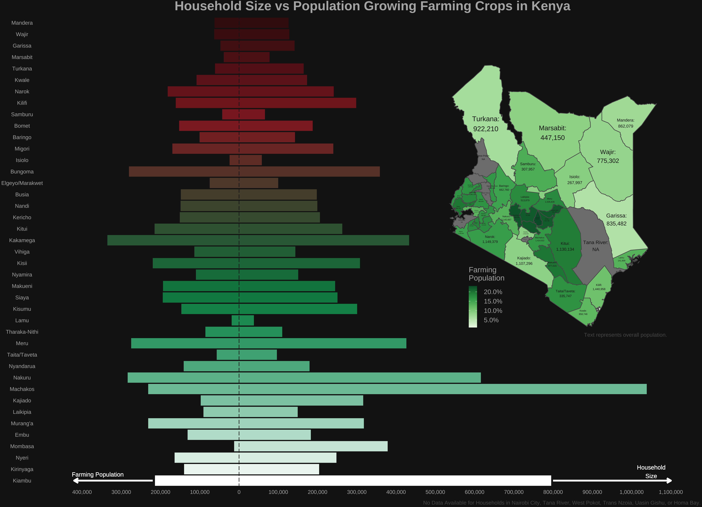

<h1 style="font-weight:normal" align="center">
  &nbsp;#TidyTuesday Contributions&nbsp;
</h1>

&nbsp;&nbsp;&nbsp;:link: [Site][Site]&nbsp;&nbsp;&nbsp;|&nbsp;&nbsp;&nbsp;:e-mail: [Email][Email]&nbsp;&nbsp;&nbsp;|&nbsp;&nbsp;&nbsp;:speech_balloon: [Twitter][Twitter]&nbsp;&nbsp;&nbsp;|&nbsp;&nbsp;&nbsp;:necktie: [LinkedIn][LinkedIn]

<!--
Quick Link
-->

[Twitter]:https://twitter.com/gates_duncan
[LinkedIn]:https://www.linkedin.com/in/duncan-gates
[Email]:mailto:duncan.gates123@gmail.com
[Site]:https://duncangates.me
[Portfolio]:https://duncangates.me/Writing

***

### [2021/03](https://github.com/rfordatascience/tidytuesday/blob/master/data/2021/2021-01-19/readme.md) 🇰🇪 Kenya Census by [Shelmith Kariuki](https://github.com/Shelmith-Kariuki/rKenyaCensus)

***

***

### [2020/52](https://github.com/rfordatascience/tidytuesday/blob/master/data/2020/2020-12-22/readme.md) 🍔️ Big Mac Index by [The Economist](https://github.com/TheEconomist/big-mac-data)

***